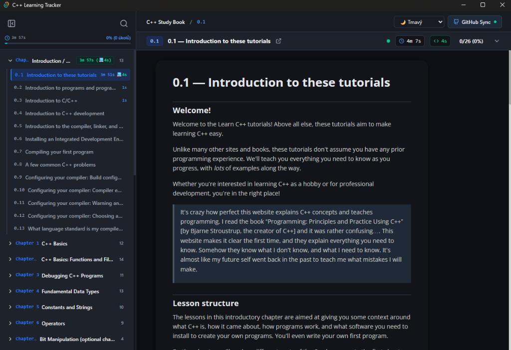
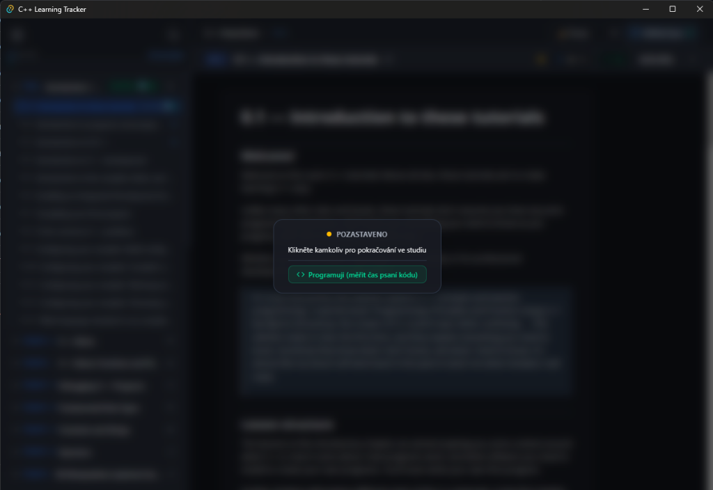
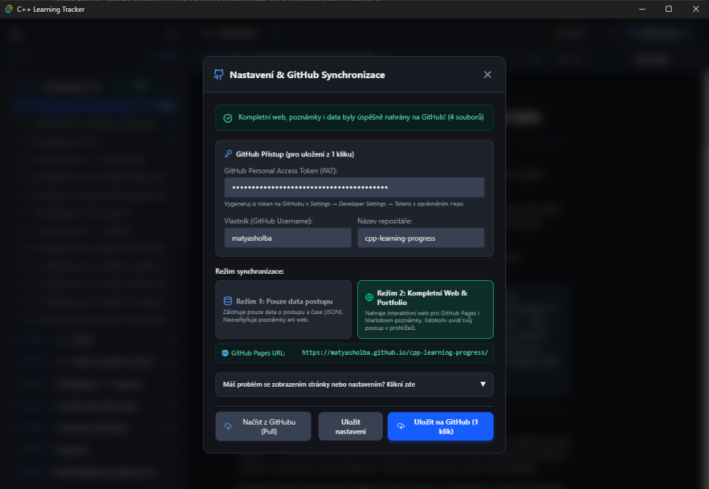

# C++ Learning Tracker (with GitHub Portfolio Sync)

A comprehensive, offline desktop learning tracker and web progress viewer for C++ students. Built to seamlessly integrate with [learncpp.com](https://www.learncpp.com), allowing you to read offline, track your study time, make notes, and sync your progress automatically to an interactive GitHub Pages view.

## 🚀 Download & Install

**[⬇️ CLICK HERE TO DOWNLOAD INSTALLER (cpp-tracker-setup.exe)](https://github.com/MatyasHolba/cpp-teacher-with-progress/raw/main/cpp-tracker-setup.exe)**

Just download the \.exe\ file above, run it, and you're good to go!

---

## 📸 Features

### 1. Offline Offline Study & Note Taking
Read the entire course offline. Mark lessons as done, and take notes directly on specific paragraphs.

### 2. Deep Time Tracking & Pause Modes
The app automatically tracks how much time you spend reading theory vs coding. 
If you lose focus, the app pauses. 

### 3. One-Click GitHub Portfolio Sync
In the settings, you can add your GitHub Token and push your entire learning progress to your own GitHub Pages with just 1 click.

## 🛠 For Developers
Created by **Matyáš Holba**.
